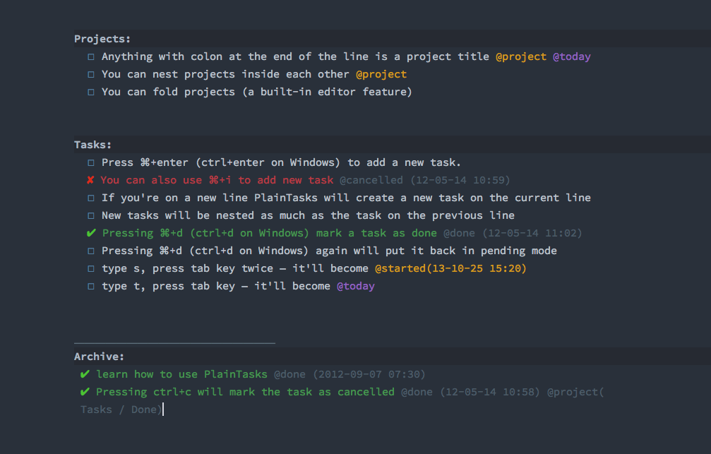

# Bright Spacegray PlainTasks Theme

A [PlainTasks](https://github.com/aziz/PlainTasks) theme created to play nicely with the Sublime [Spacegray](http://kkga.github.io/spacegray) UI and [Chris Kempson’s Base16 colour schemes](http://chriskempson.github.io/base16/#ocean). Also includes my version of the Source Code Pro fonts with better checkboxes and the PlainTasks settings file.

## Usage

To use, place in your PlainTasks package folder and replace the existing theme in the User Settings with:

	"color_scheme": "Packages/PlainTasks/tasks-bright-spacegray.hidden-tmTheme"

If the theme doesn’t apply straight away remove *hidden-* from the file name.